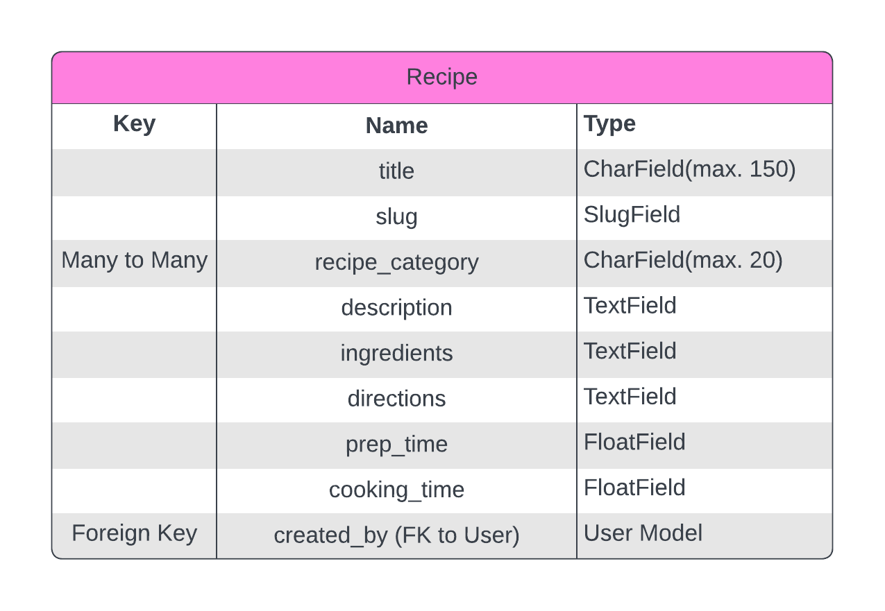

**Table of contents:**

- [Introduction](#introduction)
- [Deployed Site](#deployed-site)
- [User Experience](#user-experience)
  - [Workflow Logic Charts](#workflow-logic-charts)
  - [User Goals](#user-goals)
  - [User Stories](#user-stories)
  - [Site Owner's Goals](#site-owners-goals)
- [Features](#features)
  - [Data Model](#data-model)
  - [Further Development and Future Features](#further-development-and-future-features)
- [Testing and Validation](#testing-and-validation)
  - [Automated Testing](#automated-testing)
  - [Manual Testing Methodology](#manual-testing-methodology)
  - [W3C HTML and CSS Validation](#w3c-html-and-css-validation)
  - [Pep-8 Code Analysis](#pep-8-code-analysis)
  - [Bugs and Challenges](#bugs-and-challenges)
  - [Development](#development)
  - [Contributing](#contributing)
  - [Deployment](#deployment)
- [Technologies Used](#technologies-used)
- [Acknowledgements](#acknowledgements)

## Introduction

## Deployed Site

The program has been deployed to Heroku and can be accessed [here](https://pp4assignment-81282f23e92d.herokuapp.com/).

## User Experience

### Workflow Logic Charts

### User Goals

### User Stories

### Site Owner's Goals

## Features

### Data Model

A brief description of the five entities in the above schematic diagram:

* **User:** Represents a user of the platform who can share recipes, comment on recipes, and favourite recipes.

* **Recipe** Represents a recipe shared by a user. It includes details like title, description, ingredients, directions, etc.

* **RecipeCategory:** Represents a cuisine, category, or type of recipe e.g. ‘Italian’, ‘vegetarian’, or ‘simple’. A Many-to-Many relationship i.e. recipes can be assigned to a number of different categories.

* **Comment:** Represents a comment made by a user on a recipe, has a One-to-One relationship with the Recipe entity and includes comment_text and a date_created attribute.

* **FavouriteRecipe:** Represents the relationship between users and their favourite recipes. A One-to-Many relationship whereby a single user can favourite multiple recipes.

#### Entity Relationship Diagrams

Recipe ERD

 

### Further Development and Future Features

## Testing and Validation

### Automated Testing

### Manual Testing Methodology

### W3C HTML and CSS Validation

### Pep-8 Code Analysis

### Bugs and Challenges

## Development and Deployment

### Development

Development was started by cloning Code Institute's project template (available [here](https://github.com/Code-Institute-Org/p3-template)), and development was carried out in VSCode with changes pushed to GitHub.

### Contributing

To contribute, make a pull request from the [project repository](https://github.com/klchambers/pp4). When merged, any changes will automatically be reflected in the live deployment on Heroku.

### Deployment

## Technologies Used

* [**Django**](https://www.djangoproject.com): Python framework for templating, URL routing, admin interface, and more
* [**Visual Studio Code**](https://code.visualstudio.com/): Text editor for development
* [**Heroku**](https://www.heroku.com): Live deployment of web app
* [**Neon**](https://www.neon.tech): Serverless open-source alternative to ElephantSQL
* [**Gunicorn**](https://www.gunicorn.org): Python WSGI HTTP Server for UNIX
* [**Psycopg**](https://pypi.org/project/psycopg2/): PostgreSQL database adapter for Python
* [**Lucidchart**](https://www.lucidchart.com/pages/): Creation of diagram schema and Entity Relationship Diagrams

## Acknowledgements

* Code to register ModelAdmin classes and configure list views in recipes/admin.py adapted from [MDN Web Docs: *Django Tutorial Part 4: Django admin site*](https://developer.mozilla.org/en-US/docs/Learn/Server-side/Django/Admin_site)
