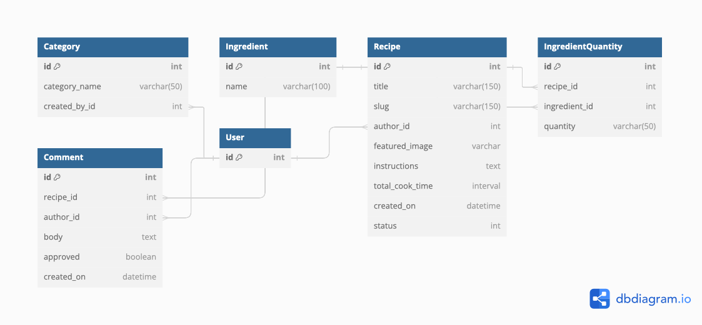

**Table of contents:**

- [Introduction](#introduction)
- [Deployed Site](#deployed-site)
- [User Experience](#user-experience)
  - [Workflow Logic Charts](#workflow-logic-charts)
  - [User Goals](#user-goals)
  - [User Stories](#user-stories)
  - [Site Owner's Goals](#site-owners-goals)
- [Features](#features)
  - [Data Model](#data-model)
  - [Further Development and Future Features](#further-development-and-future-features)
- [Testing and Validation](#testing-and-validation)
  - [Automated Testing](#automated-testing)
  - [Manual Testing Methodology](#manual-testing-methodology)
  - [W3C HTML and CSS Validation](#w3c-html-and-css-validation)
  - [Pep-8 Code Analysis](#pep-8-code-analysis)
  - [Bugs and Challenges](#bugs-and-challenges)
  - [Development](#development)
  - [Contributing](#contributing)
  - [Deployment](#deployment)
- [Technologies Used](#technologies-used)
- [Acknowledgements](#acknowledgements)

## Introduction

## Deployed Site

The program has been deployed to Heroku and can be accessed [here](https://pp4assignment-81282f23e92d.herokuapp.com/).

## User Experience

### Workflow Logic Charts

### User Goals

### User Stories

### Site Owner's Goals

## Features

### Data Model

A brief description of the entities in the above schematic diagram:

* **User:** Represents a user of the platform who can share recipes, comment on recipes, and favourite recipes.

* **Recipe** Represents a recipe shared by a user. It includes details like title, description, ingredients, directions, etc.

* **RecipeCategory:** Represents a cuisine, category, or type of recipe e.g. ‘Italian’, ‘vegetarian’, or ‘simple’. A Many-to-Many relationship i.e. recipes can be assigned to a number of different categories. In order to maintain valid, appropriate categories, they are added to recipes by site administrators through the Django admin panel.

* **Comment:** Represents a comment made by a user on a recipe, has a One-to-One relationship with the Recipe entity and includes comment_text and a date_created attribute.

* **Ingredient:** Representing an ingredient. Can be added by the user via the 'Submit a Recipe' form or through the Django administration panel.

* **IngredientQuantity:** This model facilitates the management of ingredient quantities within recipes, forming a link between specific recipes and their ingredients with respective amounts.

### Further Development and Future Features

## Testing and Validation

### Manual Testing Methodology

#### Manual Testing Methodology for Django Models

| Test Case ID | Model | Test Case Description| Steps to Perform| Expected Result|
|--------------|--------------------|---------------------------------------------------------------------------------------------------------------------------------------------------------|------------------------------------------------------------------------------------------------------------------|--------------------------------------------------------------------------|
| TC001        | Category           | Verify that a category can be created with a unique name                                                                                                | 1. Create a category with a unique name.                                                                         | Category is created successfully                                                                |
| TC002        | Category           | Verify that creating a category with a duplicate name fails                                                                                             | 1. Create a category with an existing name.                                                                      | Error is raised indicating the name must be unique                                              |
| TC003        | Category           | Verify that categories are retained when the creating user is deleted                                                                                   | 1. Create a user. 2. Create a category with this user. 3. Delete the user.                                       | Category is retained with `created_by` set to null                                              |
| TC004        | Ingredient         | Verify that an ingredient can be created with a unique name                                                                                             | 1. Create an ingredient with a unique name.                                                                      | Ingredient is created successfully                                                              |
| TC005        | Ingredient         | Verify that creating an ingredient with a duplicate name fails                                                                                          | 1. Create an ingredient with an existing name.                                                                   | Error is raised indicating the name must be unique                                              |
| TC006        | Recipe             | Verify that a recipe can be created with a unique title                                                                                                 | 1. Create a recipe with a unique title.                                                                          | Recipe is created successfully                                                                  |
| TC007        | Recipe             | Verify that creating a recipe with a duplicate title fails                                                                                              | 1. Create a recipe with an existing title.                                                                       | Error is raised indicating the title must be unique                                             |
| TC008        | Recipe             | Verify that the slug field is automatically generated based on the title                                                                                | 1. Create a recipe with a specific title.                                                                        | Slug is generated based on the title                                                            |
| TC009        | Recipe             | Verify that the recipe can have multiple categories                                                                                                     | 1. Create multiple categories. 2. Assign these categories to a recipe.                                           | Recipe is associated with multiple categories                                                   |
| TC010        | Recipe             | Verify the default status of a new recipe is 'Draft'                                                                                                    | 1. Create a new recipe.                                                                                          | Recipe status is set to 'Draft'                                                                 |
| TC011        | Recipe             | Verify the total cook time can be entered in HH:MM:SS format                                                                                            | 1. Create a recipe with a specific cook time in HH:MM:SS format.                                                 | Total cook time is saved correctly                                                             |
| TC012        | Recipe             | Verify the instructions field can handle multiline text                                                                                                 | 1. Enter multiline instructions while creating a recipe.                                                        | Instructions are saved and displayed correctly                                                  |
| TC013        | Recipe             | Verify the created_on field is automatically populated with the current date and time                                                                   | 1. Create a new recipe.                                                                                          | created_on field is populated with the current date and time                                    |
| TC014        | IngredientQuantity | Verify that an IngredientQuantity can link an ingredient and a recipe                                                                                   | 1. Create an ingredient. 2. Create a recipe. 3. Create an IngredientQuantity linking the ingredient and recipe. | IngredientQuantity is created successfully                                                      |
| TC015        | IngredientQuantity | Verify the quantity field in IngredientQuantity accepts valid data                                                                                      | 1. Create an IngredientQuantity with a specific quantity.                                                        | Quantity is saved correctly                                                                    |
| TC016        | Comment            | Verify that a comment can be created for a recipe                                                                                                       | 1. Create a recipe. 2. Add a comment to the recipe.                                                              | Comment is created and linked to the recipe                                                     |
| TC017        | Comment            | Verify the default status of a new comment is 'not approved'                                                                                            | 1. Create a new comment for a recipe.                                                                            | Comment is created with approved status set to 'False'                                          |
| TC018        | Comment            | Verify that only approved comments are counted in the comment_count property of a recipe                                                               | 1. Add approved and unapproved comments to a recipe.                                                             | comment_count returns the count of only approved comments                                       |
| TC019        | Comment            | Verify that the created_on field in Comment is automatically populated with the current date and time                                                   | 1. Create a new comment.                                                                                         | created_on field is populated with the current date and time                                    |
| TC020        | Recipe             | Verify the ordering of recipes is by created_on date in descending order (newest first)                                                                 | 1. Create multiple recipes with different created_on dates.                                                      | Recipes are ordered by created_on date in descending order                                      |

#### 

### W3C HTML and CSS Validation

### Pep-8 Code Analysis

### Bugs and Challenges

## Development and Deployment

### Development

Development was started by cloning Code Institute's project template (available [here](https://github.com/Code-Institute-Org/p3-template)), and development was carried out in VSCode with changes pushed to GitHub.

### Contributing

To contribute, make a pull request from the [project repository](https://github.com/klchambers/pp4). When merged, any changes will automatically be reflected in the live deployment on Heroku.

### Deployment

## Technologies Used

* [**Django**](https://www.djangoproject.com): Python framework for templating, URL routing, admin interface, and more
* [**Visual Studio Code**](https://code.visualstudio.com/): Text editor for development
* [**Heroku**](https://www.heroku.com): Live deployment of web app
* [**Neon**](https://www.neon.tech): Serverless open-source alternative to ElephantSQL
* [**Gunicorn**](https://www.gunicorn.org): Python WSGI HTTP Server for UNIX
* [**Psycopg**](https://pypi.org/project/psycopg2/): PostgreSQL database adapter for Python
* [**Django Allauth**](https://docs.allauth.org/en/latest/): Integrated set of Django applications addressing authentication, registration, and account management
* [**Summernote**](https://summernote.org/): Bootstrap WYSIWYG Editor
* [**Whitenoise**](https://whitenoise.readthedocs.io/en/latest/): Static file serving for Python web apps
* [**Crispy Forms**](https://django-crispy-forms.readthedocs.io/en/latest/): Django form styling
* [**Lucidchart**](https://www.lucidchart.com/pages/): Creation of diagram schema and Entity Relationship Diagrams

## Acknowledgements

* Use of Slugify to generate and save slugs adapted from code posted by [Ikechukwu Henry Odoh](https://stackoverflow.com/users/2261257/ikechukwu-henry-odoh) in [this](https://stackoverflow.com/questions/50436658/how-to-auto-generate-slug-from-my-album-model-in-django-2-0-4) Stack Overflow thread
* Code to register ModelAdmin classes and configure list views in recipes/admin.py adapted from [MDN Web Docs: *Django Tutorial Part 4: Django admin site*](https://developer.mozilla.org/en-US/docs/Learn/Server-side/Django/Admin_site)
* Use of InlineFormSet and inlineformset_factory adapted from code published here: [Django Documentation: *Creating forms from models*](https://docs.djangoproject.com/en/5.0/topics/forms/modelforms/)
* [Placeholder image](https://unsplash.com/photos/person-cutting-vegetables-with-knife-yWG-ndhxvqY) by [Alyson McPhee](https://unsplash.com/@alyson_jane) on Unsplash
* [Image](https://pixabay.com/photos/spices-kitchen-ingredients-flavor-4185324/) used on about.html was posted by [Matej Madar](https://pixabay.com/photos/spices-kitchen-ingredients-flavor-4185324/) on Pixabay
* Favicons generated using [favicon.io](https://favicon.io)
* Images used in recipes generated using DeepAI's image generator available [here](https://deepai.org/machine-learning-model/text2img)
* Recipes adapted from recipes posted at [BBC Goodfood](https://www.bbcgoodfood.com)