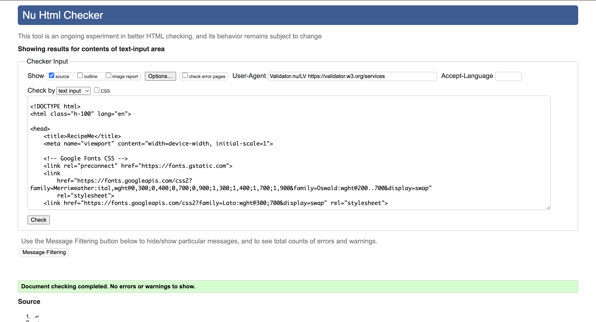
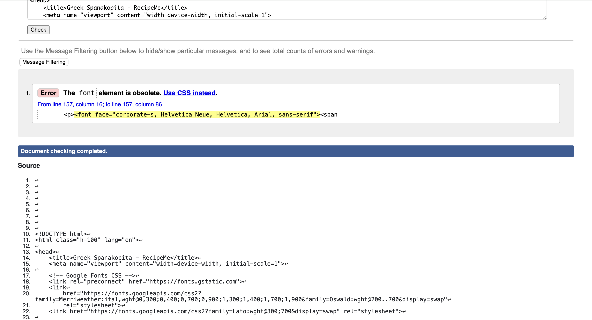
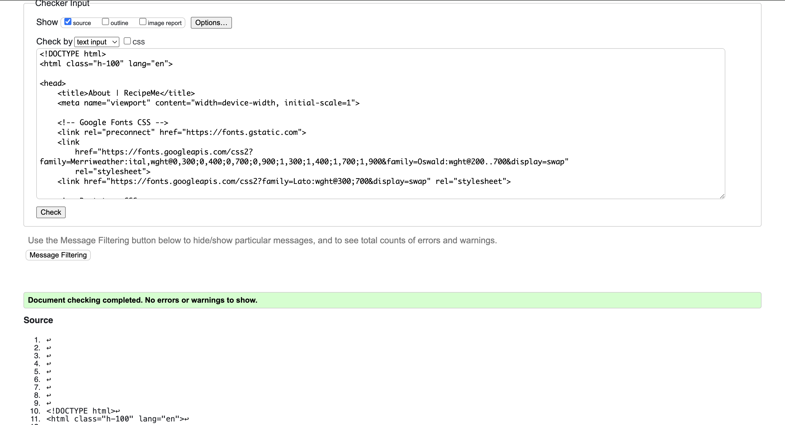
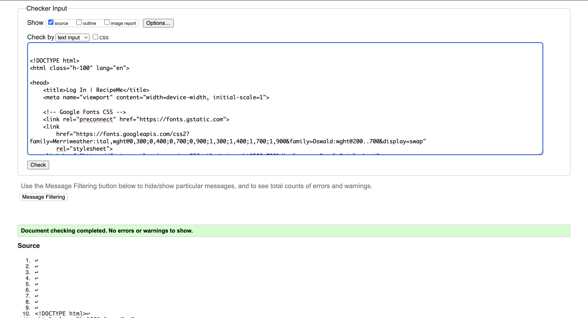
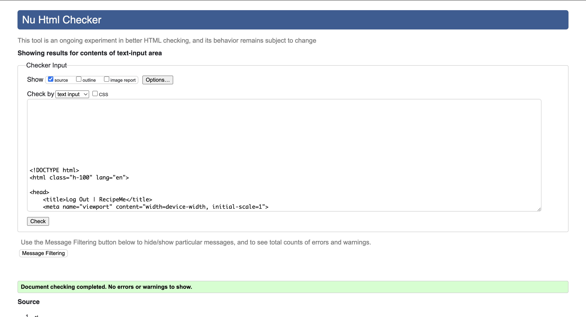
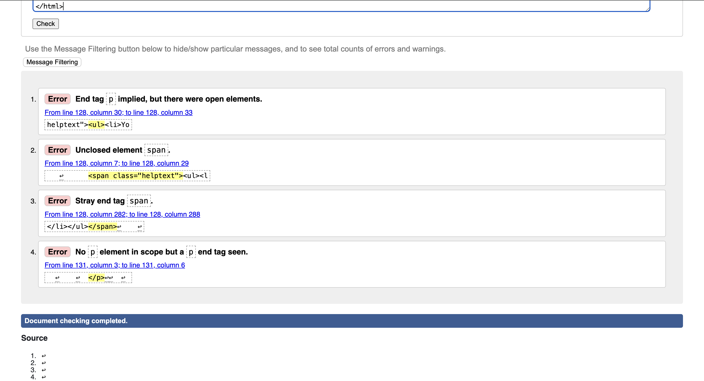
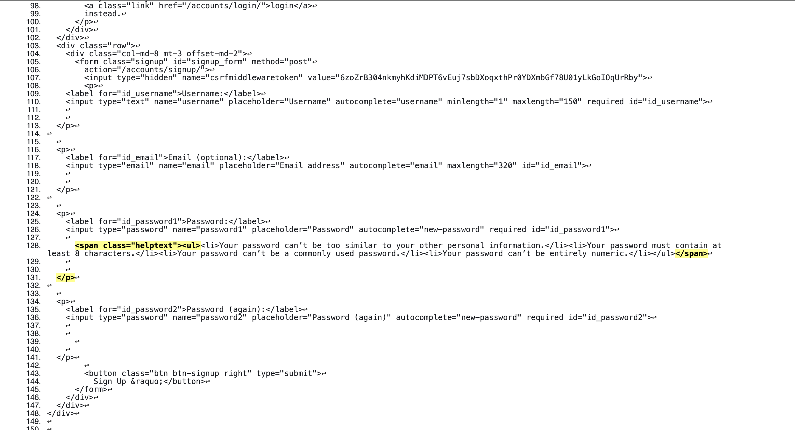

**Table of contents:**

- [Introduction](#introduction)
- [Deployed Site](#deployed-site)
- [User Experience](#user-experience)
  - [Design](#design)
  - [Workflow Logic Charts](#workflow-logic-charts)
  - [User Goals](#user-goals)
  - [User Stories](#user-stories)
  - [Site Owner's Goals](#site-owners-goals)
- [Features](#features)
  - [Data Model](#data-model)
  - [Further Development and Future Features](#further-development-and-future-features)
- [Testing and Validation](#testing-and-validation)
  - [W3C HTML and CSS Validation](#w3c-html-and-css-validation)
  - [JSHint Code Analysis](#jshint-code-analysis)
  - [Manual Testing Methodology](#manual-testing-methodology)
  - [Bugs and Challenges](#bugs-and-challenges)
  - [Development](#development)
  - [Contributing](#contributing)
  - [Deployment](#deployment)
- [Technologies Used](#technologies-used)
- [Acknowledgements](#acknowledgements)

## Introduction

## Deployed Site

The program has been deployed to Heroku and can be accessed [here](https://pp4assignment-81282f23e92d.herokuapp.com/).

## User Experience

### Design

#### Colour
RecipeMe is designed to have a simple user interface and a minimalist colour palette to provide a distraction-free experience to the user, allowing them to focus on browsing, commenting, and reading recipes and viewing images.

The background is an off-white shade (#f0f0f0), chosen to be slightly less intense than pure white, with accents in a distinctive shade of orange  to draw the users attention with these elemenst.

#### Typography

Default Bootstrap sans serif typefaces were used throughout the site for their legibility across devices, screen/font sizes, with the exception of the RecipeMe logo in the page headers. For this, the serif font [Merriweather](https://fonts.google.com/specimen/Merriweather) by [Sorkin Type](https://fonts.google.com/?query=Sorkin+Type) was chosen from Google Fonts as it is easily legible while distinct enough to establish an identity for the site.

### Workflow Logic Chart
As shown in the workflow logic chart below, the actions permitted to users vary depending on the user permissions and whether or not they are logged in.

Superusers can access the Django admin panel and approve comments & recipes, as well as create new superusers and carry out other site administraion tasks.

Any site visitor can use the basic functionality of the site (e.g. view recipes and approved comments, register for an account, or view the about page).

Only users who are logged in are able to leave comments or submit recipes, and these must be approved by site administrators before being visible to all, in order to prevent spam or other unsuitable content from being posted to the site.

### User Goals

### User Stories

### Site Owner's Goals

## Features

### Data Model

A brief description of the entities in the above schematic diagram:

* **User:** Represents a user of the platform who can share recipes, comment on recipes, and favourite recipes.

* **Recipe** Represents a recipe shared by a user. It includes details like title, description, ingredients, directions, etc.

* **RecipeCategory:** Represents a cuisine, category, or type of recipe e.g. ‘Italian’, ‘vegetarian’, or ‘simple’. A Many-to-Many relationship i.e. recipes can be assigned to a number of different categories. In order to maintain valid, appropriate categories, they are added to recipes by site administrators through the Django admin panel.

* **Comment:** Represents a comment made by a user on a recipe, has a One-to-One relationship with the Recipe entity and includes comment_text and a date_created attribute.

* **Ingredient:** Representing an ingredient. Can be added by the user via the 'Submit a Recipe' form or through the Django administration panel.

* **IngredientQuantity:** This model facilitates the management of ingredient quantities within recipes, forming a link between specific recipes and their ingredients with respective amounts.

### Further Development and Future Features

## Testing and Validation

### W3C HTML and CSS Validation

#### HTML

HTML validation of individual pages can be viewed in the drop down boxes below:

Homepage

 

Recipe Page

 

About Page

 

Submit Recipe Page

 

Login Page

 

Logout Page

 

Signup Page

 

 

Some errors were presented when the rendered HTML from this page was passed into W3C's HTML text input validator. In the HTML pasted from the page source (shown below), the Span tag and P tag from Django Allauth appear to raise errors, but on manual inspection no errors were found, and the page functions as expected.

#### CSS

RecipeMe's CSS passed the validation with no errors. Some warnings were presented, relating to styles applied through the use of Bootstrap CSS. The CSS validation results can be viewed [here](http://jigsaw.w3.org/css-validator/validator?lang=en&profile=css3svg&uri=https%3A%2F%2Fpp4assignment-81282f23e92d.herokuapp.com%2F&usermedium=all&vextwarning=&warning=1).

### JSHint Code Analysis

script.js passed through the JSHint Code Analysis tool with no errors reported. The full screenshot can be viewed in the dropdown menu below.

JSHint Code Analysis Screenshot

 

### Manual Testing Methodology

#### Manual Testing Methodology for Django Models

| Test Case ID | Model | Test Case Description| Steps to Perform| Expected Result|
|--------------|--------------------|---------------------------------------------------------------------------------------------------------------------------------------------------------|------------------------------------------------------------------------------------------------------------------|--------------------------------------------------------------------------|
| 1        | Category           | Verify that a category can be created with a unique name                                                                                                | 1. Create a category with a unique name.                                                                         | Category is created successfully                                                                |
| 2        | Category           | Verify that creating a category with a duplicate name fails                                                                                             | 1. Create a category with an existing name.                                                                      | Error is raised indicating the name must be unique                                              |
| 3        | Category           | Verify that categories are retained when the creating user is deleted                                                                                   | 1. Create a user. 2. Create a category with this user. 3. Delete the user.                                       | Category is retained with `created_by` set to null                                              |
| 4        | Ingredient         | Verify that an ingredient can be created with a unique name                                                                                             | 1. Create an ingredient with a unique name.                                                                      | Ingredient is created successfully                                                              |
| 5        | Ingredient         | Verify that creating an ingredient with a duplicate name fails                                                                                          | 1. Create an ingredient with an existing name.                                                                   | Error is raised indicating the name must be unique                                              |
| 6        | Recipe             | Verify that a recipe can be created with a unique title                                                                                                 | 1. Create a recipe with a unique title.                                                                          | Recipe is created successfully                                                                  |
| 7        | Recipe             | Verify that creating a recipe with a duplicate title fails                                                                                              | 1. Create a recipe with an existing title.                                                                       | Error is raised indicating the title must be unique                                             |
| 8        | Recipe             | Verify that the slug field is automatically generated based on the title                                                                                | 1. Create a recipe with a specific title.                                                                        | Slug is generated based on the title                                                            |
| 9        | Recipe             | Verify that the recipe can have multiple categories                                                                                                     | 1. Create multiple categories. 2. Assign these categories to a recipe.                                           | Recipe is associated with multiple categories                                                   |
| 10        | Recipe             | Verify the default status of a new recipe is 'Draft'                                                                                                    | 1. Create a new recipe.                                                                                          | Recipe status is set to 'Draft'                                                                 |
| 11        | Recipe             | Verify the total cook time can be entered in HH:MM:SS format                                                                                            | 1. Create a recipe with a specific cook time in HH:MM:SS format.                                                 | Total cook time is saved correctly                                                             |
| 12        | Recipe             | Verify the instructions field can handle multiline text                                                                                                 | 1. Enter multiline instructions while creating a recipe.                                                        | Instructions are saved and displayed correctly                                                  |
| 13        | Recipe             | Verify the created_on field is automatically populated with the current date and time                                                                   | 1. Create a new recipe.                                                                                          | created_on field is populated with the current date and time                                    |
| 14        | IngredientQuantity | Verify that an IngredientQuantity can link an ingredient and a recipe                                                                                   | 1. Create an ingredient. 2. Create a recipe. 3. Create an IngredientQuantity linking the ingredient and recipe. | IngredientQuantity is created successfully                                                      |
| 15        | IngredientQuantity | Verify the quantity field in IngredientQuantity accepts valid data                                                                                      | 1. Create an IngredientQuantity with a specific quantity.                                                        | Quantity is saved correctly                                                                    |
| 16        | Comment            | Verify that a comment can be created for a recipe                                                                                                       | 1. Create a recipe. 2. Add a comment to the recipe.                                                              | Comment is created and linked to the recipe                                                     |
| 17        | Comment            | Verify the default status of a new comment is 'not approved'                                                                                            | 1. Create a new comment for a recipe.                                                                            | Comment is created with approved status set to 'False'                                          |
| 18        | Comment            | Verify that only approved comments are counted in the comment_count property of a recipe                                                               | 1. Add approved and unapproved comments to a recipe.                                                             | comment_count returns the count of only approved comments                                       |
| 19        | Comment            | Verify that the created_on field in Comment is automatically populated with the current date and time                                                   | 1. Create a new comment.                                                                                         | created_on field is populated with the current date and time                                    |
| 20        | Recipe             | Verify the ordering of recipes is by created_on date in descending order (newest first)                                                                 | 1. Create multiple recipes with different created_on dates.                                                      | Recipes are ordered by created_on date in descending order                                      |

#### Manual Testing Methodology for `base.html`

| Test Case ID | Section         | Test Case Description                                             | Steps to Perform                                                                                          | Expected Result                                                                                 |
|--------------|-----------------|-------------------------------------------------------------------|-----------------------------------------------------------------------------------------------------------|------------------------------------------------------------------------------------------------|
| 21        | Page Structure  | Verify the base structure of the HTML document                    | 1. Open any page that extends `base.html`.                                                                | The structure includes correct DOCTYPE, head, and body elements.                               |
| 22        | Head Title      | Verify the title block is rendered correctly                      | 1. Set a title in a child template.                                                                       | The title is displayed correctly in the browser tab.                                           |
| 23        | Extra Head      | Verify the `extra_head` block is rendered correctly               | 1. Add content to the `extra_head` block in a child template.                                             | The content is included within the head section of the HTML document.                          |
| 24        | Messages        | Verify that user messages are displayed correctly                 | 1. Trigger messages in the application (e.g., form validation errors).                                    | Messages are displayed in a list format at the top of the page.                                |
| 25        | Menu Display    | Verify that the menu changes based on user authentication state   | 1. Log in as a user. 2. Check the menu. 3. Log out. 4. Check the menu again.                              | The menu displays "Change Email" and "Sign Out" for authenticated users and "Sign In" and "Sign Up" for unauthenticated users. |
| 26        | Content Block   | Verify the `content` block is rendered correctly                  | 1. Add content to the `content` block in a child template.                                                | The content is displayed correctly within the body of the HTML document.                       |

#### Manual Testing Methodology for `recipe_page.html`

| Test Case ID | Section            | Test Case Description                                                                                                    | Steps to Perform                                                                                          | Expected Result                                                                                 |
|--------------|--------------------|--------------------------------------------------------------------------------------------------------------------------|-----------------------------------------------------------------------------------------------------------|------------------------------------------------------------------------------------------------|
| 27        | Image Display      | Verify the placeholder image is shown when no featured image is provided                                                 | 1. Create a recipe without a featured image.                                                              | Placeholder image is displayed.                                                                 |
| 28        | Image Display      | Verify the featured image is shown when provided                                                                         | 1. Create a recipe with a featured image.                                                                 | Featured image is displayed.                                                                    |
| 29        | Title Display      | Verify the recipe title is displayed correctly                                                                           | 1. Create a recipe with a specific title.                                                                 | Recipe title is displayed correctly.                                                            |
| 30        | Comment Count      | Verify the comment count link works correctly                                                                            | 1. Create a recipe with comments. 2. View the recipe page. 3. Click the comment count link.               | Page scrolls to the comments section.                                                           |
| 31        | Delete Recipe      | Verify the delete button for a recipe works correctly when user is the author                                            | 1. Create a recipe. 2. Log in as the author. 3. Click the delete button.                                   | Recipe is deleted and user is redirected to the appropriate page.                               |
| 32        | Cooking Time       | Verify the total cooking time is displayed correctly                                                                     | 1. Create a recipe with a specified cooking time.                                                         | Total cooking time is displayed in the format HH:MM:SS.                                        |
| 33        | Category Display   | Verify that multiple categories are displayed correctly                                                                  | 1. Create categories. 2. Create a recipe with multiple categories.                                        | All categories are displayed, separated by commas.                                             |
| 34        | Single Category    | Verify that a single category is displayed correctly                                                                     | 1. Create a category. 2. Create a recipe with a single category.                                          | The category is displayed correctly.                                                            |
| 35        | Author and Date    | Verify the author and created date are displayed correctly                                                               | 1. Create a recipe. 2. View the recipe page.                                                              | Author name and creation date are displayed correctly.                                          |
| 36        | Ingredients List   | Verify the list of ingredients and their quantities are displayed correctly                                              | 1. Create a recipe with ingredients and quantities.                                                       | Ingredients and quantities are displayed correctly.                                             |
| 37        | Method Display     | Verify the method (instructions) are displayed correctly                                                                 | 1. Create a recipe with instructions.                                                                     | Instructions are displayed with correct formatting.                                             |
| 38        | Comments Display   | Verify comments are displayed correctly and can be added by authenticated users                                          | 1. Create a recipe. 2. Add comments to the recipe. 3. Log in as a user. 4. Add a comment.                 | Comments are displayed correctly, and new comments can be added by authenticated users.         |
| 39        | Comment Approval   | Verify unapproved comments are displayed correctly to their authors and hidden from others                               | 1. Add a comment to a recipe as a user. 2. Check the comment visibility while logged in and logged out.   | Unapproved comments are visible to their authors and hidden from others.                        |
| 40        | Comment Actions    | Verify authenticated users can delete or edit their comments                                                             | 1. Add a comment as a user. 2. Log in as the same user. 3. Attempt to delete and edit the comment.        | User can delete or edit their own comments.                                                     |
| 41        | Delete Confirmation| Verify the delete confirmation modal for comments and recipes works correctly                                            | 1. Attempt to delete a comment or recipe.                                                                 | Confirmation modal appears asking for deletion confirmation.                                    |
| 42        | Leave Comment      | Verify that only authenticated users can leave comments                                                                  | 1. Log out. 2. Attempt to leave a comment on a recipe. 3. Log in. 4. Attempt to leave a comment again.    | Comment form is only available to authenticated users.                                          |

### Bugs and Challenges

## Development and Deployment

### Development

Development was started by cloning Code Institute's project template (available [here](https://github.com/Code-Institute-Org/p3-template)), and development was carried out in VSCode with changes pushed to GitHub.

### Contributing

To contribute, make a pull request from the [project repository](https://github.com/klchambers/pp4). When merged, any changes will automatically be reflected in the live deployment on Heroku.

### Deployment

## Technologies Used

* [**Django**](https://www.djangoproject.com): Python framework for templating, URL routing, admin interface, and more
* [**Visual Studio Code**](https://code.visualstudio.com/): Text editor for development
* [**Heroku**](https://www.heroku.com): Live deployment of web app
* [**Neon**](https://www.neon.tech): Serverless open-source alternative to ElephantSQL
* [**Gunicorn**](https://www.gunicorn.org): Python WSGI HTTP Server for UNIX
* [**Psycopg**](https://pypi.org/project/psycopg2/): PostgreSQL database adapter for Python
* [**Django Allauth**](https://docs.allauth.org/en/latest/): Integrated set of Django applications addressing authentication, registration, and account management
* [**Summernote**](https://summernote.org/): Bootstrap WYSIWYG Editor
* [**Whitenoise**](https://whitenoise.readthedocs.io/en/latest/): Static file serving for Python web apps
* [**Crispy Forms**](https://django-crispy-forms.readthedocs.io/en/latest/): Django form styling
* [**Lucidchart**](https://www.lucidchart.com/pages/): Creation of diagram schema and Entity Relationship Diagrams

## Acknowledgements

* Use of Slugify to generate and save slugs adapted from code posted by [Ikechukwu Henry Odoh](https://stackoverflow.com/users/2261257/ikechukwu-henry-odoh) in [this](https://stackoverflow.com/questions/50436658/how-to-auto-generate-slug-from-my-album-model-in-django-2-0-4) Stack Overflow thread
* Code to register ModelAdmin classes and configure list views in recipes/admin.py adapted from [MDN Web Docs: *Django Tutorial Part 4: Django admin site*](https://developer.mozilla.org/en-US/docs/Learn/Server-side/Django/Admin_site)
* Use of InlineFormSet and inlineformset_factory adapted from code published here: [Django Documentation: *Creating forms from models*](https://docs.djangoproject.com/en/5.0/topics/forms/modelforms/)
* [Placeholder image](https://unsplash.com/photos/person-cutting-vegetables-with-knife-yWG-ndhxvqY) by [Alyson McPhee](https://unsplash.com/@alyson_jane) on Unsplash
* [Image](https://pixabay.com/photos/spices-kitchen-ingredients-flavor-4185324/) used on about.html was posted by [Matej Madar](https://pixabay.com/photos/spices-kitchen-ingredients-flavor-4185324/) on Pixabay
* Favicons generated using [favicon.io](https://favicon.io)
* Font family [Merriweather](https://fonts.google.com/specimen/Merriweather/about) by [Sorkin Type](https://fonts.google.com/?query=Sorkin+Type) was sourced from Google Fonts for page headers
* Images used in recipes generated using DeepAI's image generator available [here](https://deepai.org/machine-learning-model/text2img)
* Recipes adapted from recipes posted at [BBC Goodfood](https://www.bbcgoodfood.com)